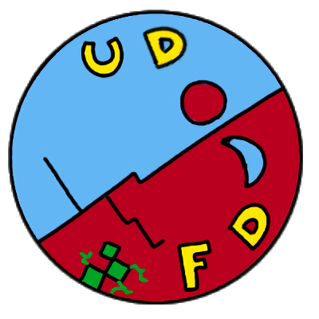

<div align="center">
    
    <h1>Unisa Deep Fake Detector</h1>
    <h3>A web app for deep fake detection</h3>
</div>

<p align="center">
 <a href="#"></a>
 
</p>
<p align="center">
 <a href="#"></a>
 <a href="#"></a>
</p>

# UDFD (Unisa Deep Fake Detector)

Unisa Deep Fake Detector (UDFD) is a deep learning-based tool to distinguishing real face images from artificially generated ones. The project places particular emphasis on the aspects of 
software engineering applied to artificial intelligence (AI), with the aim of developing a robust, reproducible and easily distributable application. 

---

## MLOps

We implemented an MLOps Level 2 pipeline with:
- Experiment tracking and data version control though Weight & Biases and DVC
- Performance monitoring
- Auto-retraining and redeployment when model performance drops


---

## Explainability
We implemented an _explainability module_ based on Full-GradCAM to show what parts of an image influenced the model's decision.

<div align="center">
  <table>
    <tr align="center">
      <td>
        
        <p>Input image</p>
      </td>
      <td style="padding-left: 20px;">
        
        <p>Input image <em>post</em> Full-GradCAM</p>
      </td>
    </tr>
  </table>
</div>

---

## Fairness

To mitigate possible biases arising from the data used to fine-tune the model, we balanced the dataset to have a uniform distribution between ethnicities and genders.  
The final dataset includes 4,000 images (50% real, 50% fake) with uniform distribution:


---

## Security

To protect the system from poisoned inputs in the active learning loop, we added a second model called **Protector** to check if user feedback is trustworthy.

<div align="center">
  
</div>

---

## Sustainability

We focused on reducing energy and resource usage by
- Choosing lighter and pre-trained models,
- Using early stopping and checkpointing to reduce training time and to eventually resume training
- Leveraging built-in optimizations

---

For more details on our implementation, please refer to the documentation available under `deliverables`. 

# Demo

A demo of the web app is showed below:

https://github.com/user-attachments/assets/6b5c504d-2585-4739-aeae-056404531d9c

# Installation Guide

To install the necessary requirements for the project, please follow the steps below.

## Installing Python
Verify you have Python installed on your machine. The project is compatible with Python `3.10` or higher.

If you do not have Python installed, please refer to the official [Python Guide](https://www.python.org/downloads/).
## Creating the Virtual Environment 
It's strongly recommended to create a virtual environment for the project and activate it before proceeding. 
Feel free to use any Python package manager to create the virtual environment. However, for a smooth installation of the requirements we recommend you use `pip`. Please refer to [Creating a virtual environment](https://packaging.python.org/en/latest/guides/installing-using-pip-and-virtual-environments/#creating-a-virtual-environment).

You may skip this step, but please keep in mind that doing so could potentially lead to conflicts if you have other projects on your machine. 

## Cloning the Repository 
To clone this repository, download and extract the `.zip` project files using the `<Code>` button on the top-right or run the following command in your terminal:
```shell 
git clone https://github.com/frenkmadda/UDFD.git
```

## Installing Requirements
To install the requirements, please: 
1. Make sure you have **activated the virtual environment where you installed the project's requirements**. If activated, your terminal, assuming you are using **bash**, should look like the following: ``(name-of-your-virtual-environment) user@user path``

2. Install the project requirements using `pip`:
```shell 
pip install -r requirements.txt
```

## Webapp: Installation and Running

The project is containerized using Docker, making it easy to set up and run:

1. Make sure you have [Docker](https://www.docker.com/get-started) and Docker Compose installed on your system
2. Clone this repository
3. From the project root directory, run:

```bash
# Build the Docker images
docker compose build

# Start the services in detached mode
docker compose up -d
```

4. Access the web application by navigating to [localhost:5500](http://localhost:5500/) in your browser

To stop the application:

```bash
docker compose down
```
